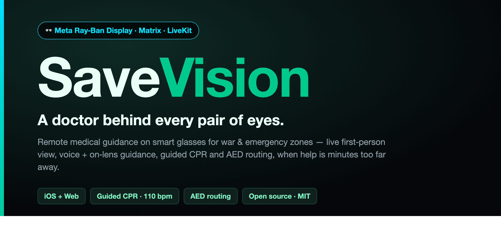

# SaveVision

**Remote medical guidance on smart glasses for war and emergency zones.**

A person in the field wearing **Meta Ray‑Ban Display** smart glasses streams their first‑person view to a remote doctor. The doctor sees through their eyes and guides them — by **voice, on‑lens text, drawings/photos, a live map, and turn‑by‑turn routing** — so an untrained bystander can keep a casualty alive until the ambulance arrives.

> The brain begins to die after ~4 minutes without oxygen. Ambulances arrive in ~8–20 minutes. SaveVision bridges that gap by putting a doctor behind every pair of eyes.

This repository is a **working prototype**, not a medical device, and is not a substitute for professional emergency care.

---

## What's inside

| Path | What it is |
|---|---|
| `ios-app/` | **SaveVision iOS app** (Swift) — connects the Ray‑Ban glasses (Meta Wearables Toolkit), publishes the POV over **MatrixRTC/LiveKit**, renders the doctor's guidance on the lens, captures GPS, speaks guidance aloud. |
| `operator-web/` | **Operator console + doctor (medic) web app** + a **Cloudflare Worker / Durable Object** backend (cases, locations, events, tasks). Live multi‑stream video, guidance, freeze‑and‑annotate, CPR assist, AED finder + routing, guidance protocols. |
| `glasses-webapp/` | A **Meta Ray‑Ban Display Web App** HUD (alternative render path) — additive 600×600 overlay. |
| `film/` | An 85‑second **Remotion** demo film of the scenario (renders programmatically). |
| `docs/` | Concept PDFs, decks, protocol & architecture docs, mockups. |

## How it works (transport)

- **Secure transport is [Matrix](https://matrix.org)** (self‑hosted Synapse). One room per case.
- **Live audio/video** over **MatrixRTC / Element Call** (LiveKit SFU) — the operator hears + sees the wearer and can speak back.
- **Guidance** (text, images, maps, location) is sent as `m.image` + `SVHUD|{json}` room messages that the app renders on the lens and reads aloud.
- A small REST/WebSocket backend tracks cases, locations and events for the operator console.

## Key features

- 📹 Live first‑person video + two‑way audio (operator ↔ wearer)
- 🩹 On‑lens guidance: banners, drawings, reference photos, **freeze‑frame annotation** with virtual objects + opacity / see‑through control
- 🫀 **CPR assist** — a 100/110/120 bpm beat sent to the wearer alongside the doctor's voice, plus breathing‑check / rescue‑breath / AED step protocols
- 🔌 **AED (defibrillator) finder** (OpenStreetMap) + walking **route to the nearest AED**, drawn on the lens
- 🗺 Live map + real GPS, expandable
- 🧠 Optional **AI guidance** (Claude vision, MARCH‑structured) behind an operator‑approval gate — opt‑in, off by default
- 🎬 Programmatic demo film (Remotion)

## Tech stack

- **iOS app** — Swift · SwiftUI · Meta **Wearables Device Access Toolkit** (MWDAT: camera + display) · **LiveKit** Swift SDK · **matrix‑rust‑sdk** · CoreLocation · AVFoundation (TTS) · Sentry · XcodeGen · Fastlane.
- **Operator / doctor web** — vanilla **JS/HTML/CSS** (no framework) · **Leaflet** + **OpenStreetMap** (maps) · **Overpass** (AEDs) + **OSRM** (routing) · **livekit-client** · Matrix **Client‑Server API**.
- **Backend** — **Node.js** (dev server) and **Cloudflare Workers + Durable Objects** (prod) · REST + **WebSocket**.
- **Transport** — **Matrix** (self‑hosted Synapse) · **MatrixRTC / Element Call** over a **LiveKit** SFU · **coturn** (TURN).
- **AI (optional)** — **Anthropic Claude** vision for MARCH‑structured guidance (operator‑approved, off by default).
- **Demo film** — **Remotion** (React + TypeScript).
- **Deploy** — Cloudflare (**Wrangler**) for the app + Worker; static hosting works on Netlify.

## Quick start

### Operator web + backend
```bash
cd operator-web
npm install
npm start                      # http://localhost:8080  (console.html / medic.html / mobile.html)
# Deploy to Cloudflare:  npx wrangler deploy
```
No secrets are committed. Configure at runtime:
- Operators paste their **Matrix access token** in the UI (or wire your own auth).
- Optional Worker secrets: `ANTHROPIC_API_KEY` (AI guidance — billed per use), `TURN_URL` / `TURN_USER` / `TURN_PASS` (cross‑network calls).

### iOS app
```bash
cd ios-app
cp SaveVision/Secrets.example.xcconfig SaveVision/Secrets.xcconfig   # fill in your values (gitignored)
xcodegen generate && open SaveVision.xcodeproj
```

### Demo film
```bash
cd film && npm install && npm run studio   # preview;  npm run render → out/savevision.mp4
```

## Security & privacy

- **No credentials, tokens, or API keys are in this repository.** All endpoints are placeholders (`matrix.example.org`, `your-worker.example.workers.dev`). Provide your own via env / `Secrets.xcconfig` / the UI.
- Production guidance: self‑host the homeserver, LiveKit SFU and map/AED data; enable Matrix end‑to‑end encryption; add real operator authentication.

## License

MIT — see [LICENSE](LICENSE). Built as a prototype for humanitarian / emergency use.
